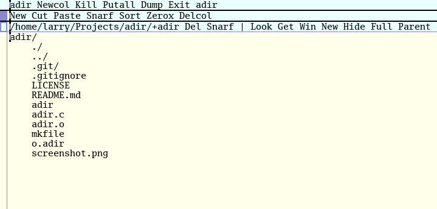

# adir

> Simple client directory viewer for Plan 9's Acme editor



## Installation

This client requires an installation of [plan9port](https://github.com/9fans/plan9port), as it piggybacks on various libraries (in particular [`libacme`](https://9fans.github.io/plan9port/man/man3/acme.html)) and takes advantage of p9p's build files. Assuming the `PLAN9` environmental variable points to your p9p installation, you should be able to compile `adir` with `mk` as follows:

```
git clone https://github.com/lewis-weinberger/adir.git
cd adir
mk install
```

To install the executable at a custom location, set the `BIN` variable (e.g. `mk install BIN=/usr/local/bin`). To remove object files and start afresh, use `mk clean`. 

To use it within Acme, make sure `adir` is installed somewhere on your `PATH`.

## Usage

M2 on `adir` in a window's tag to open its directory context as a tree, in a new window labelled `/path/to/directory/+adir`.

To navigate the tree use:

- M3 to unfold/fold directories into sub-trees, and open files with the plumber as usual in Acme. 
- M2 to run executables, or to set a sub-directory as the root of the tree.

Note that symbolic links are followed, and handled based on their target. Acme can only run executables that are in its `PATH`, so you may need to use the `Full` command (see below) first. Commands will be run in the currently shown parent directory.

The tree's window tag has some additional built-in commands:

- `Get` to refresh the contents of the directory tree.
- `Win` to open a shell window.
- `New` to open a new `adir` window.
- `Hide` to toggle whether hidden files are displayed in the tree.
- `Full` to toggle showing the absolute paths of files.
- `Parent` to move the root to the parent directory.

By default the `Get`, `Win` and `New` commands will work at the root of the tree, however M2+M1 chording can apply them to a sub-directory. For example to open a shell somewhere else, first place your cursor on the desired sub-directory in the tree, then use the M2+M1 chord on the `Win` command in the tag. Similarly for refreshing a sub-directory with `Get` or opening a new `adir` window on a sub-directory with `New`. `Get` will also try to open the directory indicated by the window name (this can be used to quickly change the root of the tree).

Note that `Get`, `Hide` and `Full` will redraw the entire directory tree. `adir` will also respect the `acmeshell` environment variable when using the `Win` command.

If hidden files are shown, the `../` entry can be used to open (or change to) the parent directory.

**Note**: `adir` treats file names internally as byte strings, and does a simplistic byte-by-byte comparison to order them. This means UTF-8 encoded file names will be sorted alphabetically, however the lack of normalisation and canonical decomposition may result in a different ordering of non-ASCII characters (such as accented ones).

## Alternatives

This was mostly an exercise in understanding how to interface with Acme under the hood. `adir` was inspired by some similar projects written in Go:

- [acme-corp](https://github.com/sminez/acme-corp)
- [xplor](https://bitbucket.org/mpl/xplor)

## License

[MIT](./LICENSE)
